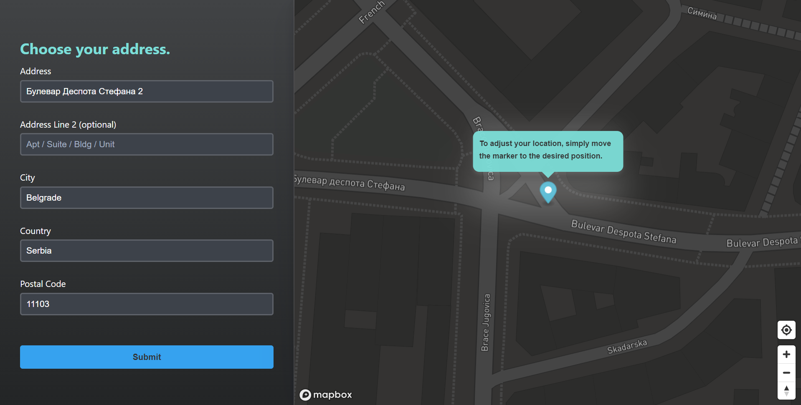

# Address Autocomplete



## Problem Description and Solution

My task was to develop an address autocomplete feature, a crucial component for online forms or checkouts, which suggests potential addresses to users as they type. This feature plays a significant role in enhancing the user experience by minimizing typing errors and providing accurate address data for businesses.

I developed a simple React application that encapsulates the address autocomplete functionality. For the autocomplete service, I leveraged the power of Mapbox's Geocoding API, known for its accuracy and efficiency.

In the application, users can start typing their address in the Address field, which then presents them with a dropdown of address suggestions. When an address is selected, the City, Postcode, and Country fields are automatically populated, further enhancing the user experience.

Additionally, the application includes a map feature, developed using Mapbox, which allows users to confirm or fine-tune their location if necessary. This feature is essential as the latitude/longitude data associated with addresses is not always up-to-date.

## Getting Started

Follow these steps to run the application:

1. **Clone the repository**

   Use the following command to clone the repository to your local machine:

   ```bash
   git clone https://github.com/darkosimic025/address_autocomplete.git
   ```

2. **Install Dependencies**

   Navigate to the cloned repository directory and install the necessary dependencies using Yarn:

   ```bash
   cd address_autocomplete
   yarn install
   ```

3. **Set Up Environment Variables**

   Create a `.env` file in the root directory of the project. Add the following line to the file:

   ```bash
   VITE_MAPBOX_TOKEN=<your-mapbox-token>
   ```

4. **Run the Application**

   Now you're ready to run the application. Use the following command to start the local development server:

   ```bash
   yarn dev
   ```

   The application will now be running at `http://localhost:5173/`.

## Technical Choices and Architectural Decisions

- **React**: My go-to library for building user interfaces due to its component-based approach and robust ecosystem.

- **TypeScript**: An indispensable tool for working with JavaScript at scale. It provides a level of safety and predictability that is crucial in a production environment.

- **Vite**: An excellent tool for a modern development experience. It provides instant server start-up and offers fast hot module replacement.

- **React Hook Form & Yup**: A performant, flexible, and developer-friendly solution for form handling and validation. They work great with TypeScript for form validation.

- **Axios**: My choice for making API requests. Its easy-to-use API and comprehensive feature set streamline asynchronous HTTP communication.

- **Mapbox GL**: An ideal solution for interactive, high-performance map visualizations. This library enhances the user experience by enabling precise address selection.

- **React Query**: My solution for managing async state in a React application. It provides a multitude of out-of-the-box features such as caching and synchronization, which simplifies state management.

- **Styled Components**: A personal preference for CSS-in-JS styling.

- **i18next & react-i18next**: A powerful internationalization-framework for providing multi-language support.

- **Jest, Testing Library, Vitest**: A reliable testing stack that provides a user-centric testing approach, excellent integration with Vite, and modern testing features.

- **ESLint**: A must-have tool for enforcing coding standards and catching potential errors and issues early in the development process.

## Trade-offs and Future Improvements

During the development of this project, I had to make certain trade-offs due to time constraints. If given more time, there are several aspects I would improve or handle differently:

- **Map Library Choice**: The current map library, Mapbox GL, has a significant JavaScript size. If the application required the map only for this form, I would consider a more lightweight solution. However, for applications requiring more complex map interactions, Mapbox GL remains a strong choice due to its extensive feature set.

- **Testing**: I would dedicate more time to writing unit tests for all UI components and integration tests pertinent to this task. This would further enhance the reliability of the application.

- **Error Boundaries**: Currently, there is a single general error boundary. Given more time, I would implement more granular error boundaries for different components and error types. This would improve the resilience of the application and offer a better user experience during unexpected failures.

- **Logging**: I would add a proper logging mechanism to the application to help with debugging and performance monitoring.

- **Performance Optimization**: While Mapbox GL is feature-rich, it has a substantial JavaScript footprint. Given more time, I'd explore better performance optimization strategies, specifically around the map feature. A common technique to tackle such issues is code splitting. If I were using Webpack, I would utilize its Code Splitting feature to split the map's code and load it only when necessary. However, as the project is built with Vite, which employs a different code-splitting technique, further investigation would be needed to adopt a similar strategy.

- **Design and Styling**: I would devote more time to refining the design and styling of the application, including the creation of dark and light themes and better centralized styling.

- **Map Display State**: Currently, an empty space is displayed until an address is selected. My idea would be to display a placeholder image or some form of visual feedback in this space when the map is not yet available.

- **Responsiveness**: While the application is responsive, there is room for further improvement to ensure an optimal experience across different devices and screen sizes.
